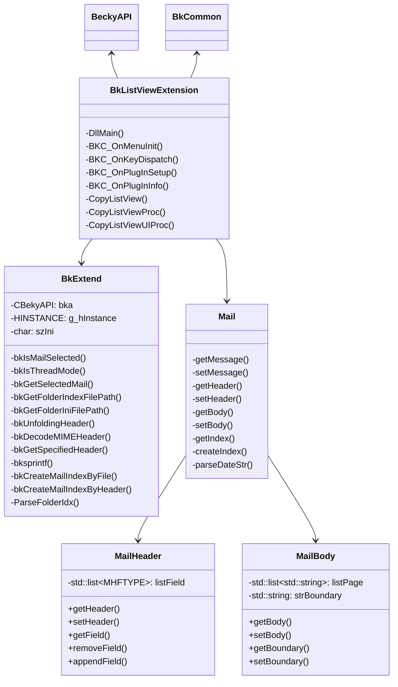

# BkListViewExtension 設計書

**最終更新日**: 2012.06.05  
**更新者**: tatsurou

---

## 機能要件

### 基本機能

メールの表示項目をテキストへコピーする機能を提供する

- Becky!のメニューに項目を追加
- ショートカットキーを登録
- コピーしたサブジェクトはプレーンテキスト形式
- 選択したメールのサブジェクトが対象
- 複数メールを選択している場合は全てのサブジェクトが対象
  - ツリー表示している場合はツリー構造を再現

**ツリー構造を再現してコピーした例**:
```
[TESTML 001] TEST
 [TESTML 002] Re: TEST
  [TESTML 003] Re: Re: TEST
```

### コピーフォーマットの設定

単独メールのコピーフォーマットを設定できる

- Becky!テンプレートのマクロシンボルを利用できる
  - 例: `%s`は参照メールのSubjectフィールドを示す


- Becky!の現在の表示項目をそのまま表示できる（※必須ではない）
- 区切り文字列を指定できる
  - デフォルトは `\t`
  - 区切り文字列に改行（`\r`, `\n`）は使えない。使用した場合、`\r`, `\n`は無視される
  - ※分かりやすさのため。また複数メール選択時には1行に収まる必要があるため
- マクロシンボルは「表示」→「表示項目」で指定できるものに限る
  - 時刻に関するマクロシンボル

リストビューがスレッド表示されている場合のコピーフォーマットも設定できる

### ショートカットキー

ショートカットキーを設定できる

- デフォルトは `Ctrl + J`

---

## 使用時のイメージ

### 設定例

**コピーフォーマット**: `%s %f %D{%Y/%m/%d}`

### 使用手順

1. メールを選択
  * 
2. キー `Ctrl + J` を入力
3. メモ帳へ貼り付け
  * 

**貼り付け結果例**:
```
Logwatch for chowder.zuppa.mine.nu (Linux)  logwatch@zuppa.mine.nu  2012/06/03 04:02:09
```

---

## UI設計 (1/2)

### メール表示項目コピー機能の実行（メニュー項目）

- Becky!本体のメニューバー「編集(E)」に追加
- エージェント機能の次に項目を追加
- 項目を実行すると本機能を実行


以下を追加

`□ リストビューの項目をコピー Ctrl+J`

### コピーフォーマットの設定画面の表示

- `ツール(T)` → `プラグインの設定(U)` → `BkListViewExtension`を追加
- 項目を実行すると設定画面を新規に開く


### コピーフォーマットの設定画面

- スレッド表示OFF時のコピーフォーマット設定項目がある
- スレッド表示ON時のコピーフォーマット設定項目がある
- コピーフォーマットの表示例がある（※必須ではない）
- Becky!の表示形式に従うことができる（※必須ではない）

---

## UI設計 (2/2)

### コピーフォーマットの設定画面

#### リストビューのスレッド表示がOFFのとき

- ○ Becky!の表示項目の設定に従う
  - 区切り文字列: `\t`
- ● 指定する:
  - フォーマット: `%D{%Y/%m/%d %H:%M} %s - %f`

**コピー結果例**:
```
2012/01/01 12:30 [TESTML 001] TEST - tatsurou@zuppa.mine.nu
```

#### リストビューのスレッド表示がONのとき

- ○ Becky!の表示項目の設定に従う
  - 区切り文字列: `\t`
- ● 指定する:
  - フォーマット: `%s`
  - 行頭文字列
    - 一般項目: `├─`
    - 項目間: `│ `
    - 最終項目: `└─`

**コピー結果例**:
```
[TESTML 001] TEST
├─[TESTML 002] Re: TEST
│ ├─[TESTML 003] Re: Re: TEST
│ └─[TESTML 004] Re: Re: TEST
└─[TESTML 005] Re: TEST
```

---

## クラス図



主要なクラス:
- **BkListViewExtension**: プラグインのメインクラス
- **BkExtend**: Becky! API拡張機能
- **Mail**: メール情報を扱うクラス
- **MailHeader**: メールヘッダー情報
- **MailBody**: メール本文情報
- **BeckyAPI**: Becky! APIラッパー
- **BkCommon**: 共通機能

---

## データ形式 - 設定

### スレッド表示がOFFのときのコピーフォーマット

#### IDC_CPFMT_THOFF_RULE
- 数値（最大値: 1）（デフォルト: 0）
  - 0: Becky!の表示項目の設定に従う
  - 1: 指定する

#### IDC_CPFMT_THOFF_FLWBK_SEPSTR
- 文字列（最大文字数: 256文字）（デフォルト: `\t`）
- 任意: 区切り文字列
- `\t`をタブ文字列として認識する
- `\r`, `\n`は無視する

#### IDC_CPFMT_THOFF_FORMAT
- 文字列（最大文字数: 256文字）（デフォルト: `%D{%Y/%m/%d %H:%M} %s %f`）
- 任意: コピーフォーマット文字列
- Becky!のマクロシンボルが使用できる
- 使用できるマクロシンボル: `%f`, `%t`, `%d`, `%D`, `%R`, `%W`, `%T`, `%i`, `%I`, `%s`, `%S`, `%n`
- `\r`, `\n`は無視する

#### IDC_THON_RESULT_SAMPLE
- 文字列（最大文字数: なし）（デフォルト: なし）
- 固定: コピー結果例

### スレッド表示がONのときのコピーフォーマット

#### IDC_CPFMT_THON_RULE
- ※CPFMT_THOFF_RULEと同じ

#### IDC_CPFMT_THON_FLWBK_SEPSTR
- ※CPFMT_THOFF_SEPSTRと同じ

#### IDC_CPFMT_THON_FORMAT
- ※CPFMT_THOFF_FORMATと同じ

#### IDC_CPFMT_THON_BULLET_NORMAL
- 文字列（最大文字数: 32文字）（デフォルト: `├─`）
- 任意: 項目が複数あり、最終項目でない場合の行頭文字列
- `\r`, `\n`は無視する

#### IDC_CPFMT_THON_BULLET_JOINT
- 文字列（最大文字数: 32文字）（デフォルト: `│ `）
- 任意: 同一階層の項目の行頭文字を接続する文字列
- `\r`, `\n`は無視する

#### IDC_CPFMT_THON_BULLET_LAST
- 文字列（最大文字数: 32文字）（デフォルト: `└─`）
- 任意: 最後の項目の行頭文字列
- `\r`, `\n`は無視する

#### IDC_THOFF_RESULT_SAMPLE
- 文字列（最大文字数: なし）（デフォルト: なし）
- 固定: コピー結果例

### ダイアログボックス設定時のサンプルメールインデックス

#### SAMPLE_MAIL_INDEX
- 文字列（最大文字数: 1024文字）
- 区切り文字: `\0x01`（Becky!と同じ）

---

## データ形式 - iniファイル

### PROPERTY

- CPFMT_THOFF_RULE
- CPFMT_THOFF_FLWBK_SEPSTR
- CPFMT_THOFF_FORMAT
- CPFMT_THON_RULE
- CPFMT_THON_FLWBK_SEPSTR
- CPFMT_THON_FORMAT
- CPFMT_THON_BULLET_NORMAL
- CPFMT_THON_BULLET_JOINT
- CPFMT_THON_BULLET_LAST

---

## 要件の実装洗い出し

### Becky!にショートカットを追加する

- BKC_OnKeyDispatchを使用
- Becky!のショートカットキーと競合するかどうかはAPIからは判定不可
- `$データフォルダ\Becky.key`, `Dana.key`にショートカットキー一覧がある

### Becky!にメニュー項目を追加する

- BKC_OnMenuInitにて`nType==BKC_MENU_MAIN`として処理する

### 設定画面のメニュー項目を追加する

- BKC_OnPlugInSetupにて設定画面を表示する処理を記述
- 戻り値は正の値にする

### 設定を保存する

- szIniに設定を書き出し
- GetPrivateProfileInt, WritePrivateProfileStringを使って読み書き

### リストビュー項目をコピーする

#### スレッド設定の有効・無効をリアルタイムに把握する

- `$データフォルダ\xxxxx.mb#tatsurou@zuppa.mine.nu#INBOX[1f].ini`等、メールボックス直下のFolder.iniに`[Status]` → `Thread=[01]`の設定がある
- 上記iniは設定反映時にリアルタイムに変更される

#### スレッド構造を取得する

- Folder.idxのフォーマットを解析が必要
- スレッド構造を解析。「Jamie Zawinski」によるスレッド化が一般的な既存の方法

#### マクロシンボルの置換

- GetHeader, GetSpecifiedHeaderを駆使
- BkCommon.cppのCMIMEItemクラスを使用可能

#### 複数選択しているメールのIDを取得する

- GetNextMailのヘルプを参照
- 検索開始メールIDを-1として、bSelectedをTrueにする

#### メールの文字コードからUnicodeへ変換する

- WideCharToMultiByte, MultiByteToWideCharを使用

### Becky!マクロシンボルを展開する

#### 「送信日時」「受信日時」「配信日時」について

- **送信日時**: ヘッダのDateの時刻
- **受信日時**: クライアントがメールを受信した時刻。Folder.idxに記載（メールデータには記載なし）
- **配信日時**: クライアントが接続するメールサーバがメールを受信した時刻。メールヘッダのReceivedの一番上の時刻を採用

#### Folder.idxのフォーマット

- 公式情報: http://www.rimarts.com/b2board/b2board.cgi?ol=200602&tree=r30943
- IMAPの場合Folder.idxがリアルタイムに更新されないため、インデックスを作成する必要がある

---

## テスト

### DateTime - Parseメソッド

#### 曜日あり日時が解析できるか
- 例: `"Thu, 7 Jun 2012 11:46:01 -0700"`

#### 曜日なし日時が解析できるか
- 例: `"7 Jun 2012 13:46:41 +0900"`

#### 秒なし日時が解析できるか
- 例: `"7 Jun 2012 13:46 +0900"`

#### フォーマットに従わない文字列でエラーを返すか

- 例: `"7 Jun 2012 13:46 +090"` （ゾーンが3文字）
- 例: `"7 Jun 2012 13:46:61 +0900"` （秒が60以上）
- 例: `"Thu 7 Jun 2012 13:46 +0900"` （曜日の直後にカンマ","がない）

---

## 更新履歴

### 2012/06/05

- プラグインの名前をBkMailListViewExtensionからBkListViewExtensionに変更
- Becky!のヘルプではリストビューが正式名称であるため

### 2012/07/31

- Iniファイルのフォーマットを記載
- CPFMT_THOFF_RULE / CPFMT_THON_RULEの最大値を256から1に変更
- ソースコード内では最大値を超えないものとして扱えるようにした

### 2012/08/18

- メールの文字コードからUnicodeへ変換する機能を実装洗い出しに追記

### 2013/05/03


- クラス図を追加
